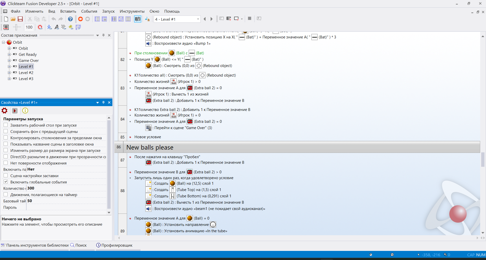

# Русский язык для Clickteam Fusion 2.5

    
     
     

Русский язык для программы [Clickteam Fusion 2.5](https://www.clickteam.com/clickteam-fusion-2-5) с переводом её интерфейса, руководства и некоторых расширений.

## Скачивание и установка

### GitHub

Обычный способ (релизная версия)

 

1. Найдите сбоку заголовок Releases и нажмите на последний выпуск под ним
2. Нажмите на архив, прикреплённый к выпуску, чтобы скачать архив
3. Откройте архив
4. Распакуйте папку ru-ru по пути C:\Program Files (x86)\Steam\steamapps\common\Clickteam Fusion 2.5\Languages.
5. Если у вас нет папок по этому пути, найдите папку расположения вашей копии Clickteam Fusion 2.5 и распакуйте содержимое архива в папку Languages в ней
6. Откройте Clickteam Fusion 2.5
7. Зайдите в Tools > Preferences > General
8. Нажмите на Английский (США) и выберите Русский (Россия) из выпадающего списка
9. Перезапустите Clickteam Fusion 2.5
10. Profit!

Обычный способ (бета-версия)

 

1. [Перейдите сюда](https://github.com/RushanM/Clickteam-Fusion-2.5-Russian-Language/releases) и вы попадёте на страницу всех выпусков репозитория
2. Найдите последний бета-выпуск
3. Нажмите на архив, прикреплённый к выпуску, чтобы скачать архив
4. Откройте архив
5. Распакуйте папку ru-ru по пути C:\Program Files (x86)\Steam\steamapps\common\Clickteam Fusion 2.5\Languages.
6. Если у вас нет папок по этому пути, найдите папку расположения вашей копии Clickteam Fusion 2.5 и распакуйте содержимое архива в папку Languages в ней
7. Откройте Clickteam Fusion 2.5
8. Зайдите в Tools > Preferences > General
9. Нажмите на Английский (США) и выберите Русский (Россия) из выпадающего списка
10. Перезапустите Clickteam Fusion 2.5
11. Profit!

Альтернативный способ (бета-версия)

 

1. Нажмите зелёную кнопку **`< > Code ▾`** над репозиторием
2. Нажмите [**`Download ZIP`**](https://github.com/RushanM/Clickteam-Fusion-2.5-Russian-Translation/archive/refs/heads/main.zip) cнизу появившегося окна, чтобы скачать архив
3. Откройте архив
4. Распакуйте папку ru-ru по пути C:\Program Files (x86)\Steam\steamapps\common\Clickteam Fusion 2.5\Languages.
5. Если у вас нет папок по этому пути, найдите папку расположения вашей копии Clickteam Fusion 2.5 и распакуйте содержимое архива в папку Languages в ней
6. Откройте Clickteam Fusion 2.5
7. Зайдите в Tools > Preferences > General
8. Нажмите на Английский (США) и выберите Русский (Россия) из выпадающего списка
9. Перезапустите Clickteam Fusion 2.5
10. Profit!

### Game Jolt

Раскрыть

 

1. Нажмите Download, чтобы скачать архив
2. Откройте архив
3. Распакуйте папку ru-ru по пути C:\Program Files (x86)\Steam\steamapps\common\Clickteam Fusion 2.5\Languages.
4. Если у вас нет папок по этому пути, найдите папку расположения вашей копии Clickteam Fusion 2.5 и распакуйте содержимое архива в папку Languages в ней
5. Откройте Clickteam Fusion 2.5
6. Зайдите в Tools > Preferences > General
7. Нажмите на Английский (США) и выберите Русский (Россия) из выпадающего списка
8. Перезапустите Clickteam Fusion 2.5
9. Profit!

### Яндекс Диск

Раскрыть

 

1. Нажмите на архив последней версии
2. Нажмите на кнопку «Скачать» в верхней панели, чтобы скачать архив
3. Откройте архив
4. Распакуйте папку ru-ru по пути C:\Program Files (x86)\Steam\steamapps\common\Clickteam Fusion 2.5\Languages.
5. Если у вас нет папок по этому пути, найдите папку расположения вашей копии Clickteam Fusion 2.5 и распакуйте содержимое архива в папку Languages в ней
6. Откройте Clickteam Fusion 2.5
7. Зайдите в Tools > Preferences > General
8. Нажмите на Английский (США) и выберите Русский (Россия) из выпадающего списка
9. Перезапустите Clickteam Fusion 2.5
10. Profit!

## Способствовали разработке

* [**Рушан Мухутдинов**](https://github.com/RushanM): создал русификатор и работает над ним
* [**Глеб Капустин**](https://github.com/GKProduction): подал множество идей и исправлений по поводу перевода
* [**Даниил Струц**](https://github.com/RedmanEXE): позволил решить одну из проблем несовместимости перевода с системой

## Материальная поддержка

Если моя работа нравится вам настолько, что вы готовы поблагодарить меня деньгами, можно сделать это по следующим ссылкам:

* [Boosty](https://boosty.to/rushanm)
* [VK Pay](https://vk.me/moneysend/deflecta)
* [Donation Alerts](https://www.donationalerts.com/r/deflecta)
* [ЮMoney](https://yoomoney.ru/to/410015215253910)

## На других ресурсах

* [Game Jolt](https://gamejolt.com/games/fusion-ru/625501)
* [Официальный сайт](https://rushan.neocities.org/fusion)
* [Яндекс Диск](https://disk.yandex.ru/d/sWhcljP7rKj5Sw)
* [Steam](https://steamcommunity.com/sharedfiles/filedetails/?id=2369261143)
* [c2community](http://c2community.ru/forum/viewtopic.php?t=17398)